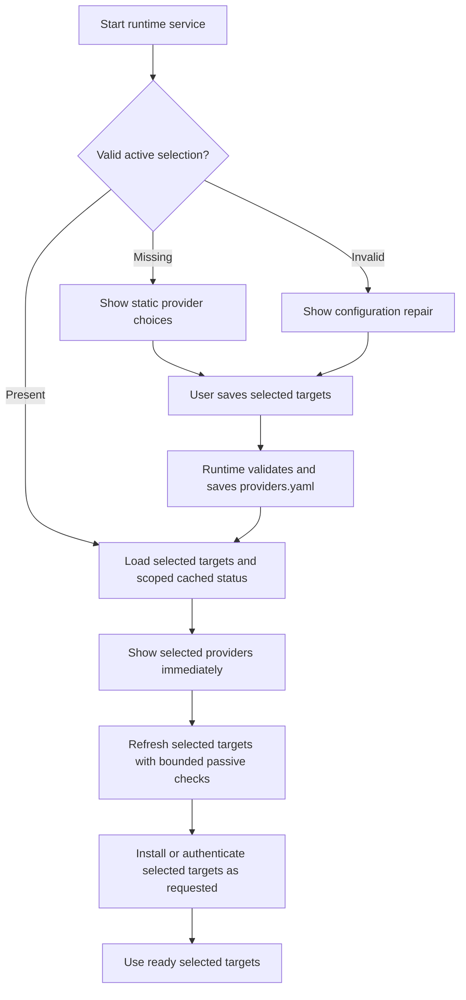

# SPEC-030: Provider Selection Before Bootstrap Probes

## Metadata

| Field | Value |
|-------|-------|
| **Status** | Approved; implementation in progress |
| **Owner** | User |
| **Reviewer** | User |
| **Last updated** | 2026-09-16 |
| **Related ADR** | [ADR-039](../decisions/039-use-selected-provider-config-as-the-resource-boundary.md) (Accepted) |
| **Delivery plan** | [PLAN-039](../plans/PLAN-039-provider-selection-bootstrap-rollout.md) (In progress) |

## Summary

Let users choose the providers they intend to use before Cats spends resources
detecting or initializing them. Apply the same selection to standalone runtime,
local Platform development, and packaged Desktop. The active `providers.yaml`
remains the source of declared provider targets; runtime enforces that scope and
hosts consume it. Selection is independent of whether a provider is installed,
authenticated, reachable, or usable at this moment.

The working interpretation of the user's ROI is the provider scope they choose
to let Cats manage and use. It is not an automatic cost or model-ranking score.

## Current Findings

These are source-inspection findings, not startup performance measurements:

- The default active file is `~/.cats/runtime/config/providers.yaml`, resolved
  from `CATS_RUNTIME_DIR` when set. Desktop's managed runtime uses the same root
  convention. It is not `~/.cats/cats-runtime/config/providers.yaml`.
- The separated-backend YAML already acts as a positive list for execution
  targets. Normal provider diagnostics and session discovery largely enumerate
  configured targets.
- `BootstrapService.probeProviders()` instead iterates all `KNOWN_PROVIDERS`,
  with up to 12 workers, and requests forced light assessments. Neither
  `/setup-scan` nor the service accepts a selected target scope.
- Light CLI detection is already passive after the September 15 correction:
  it must not execute provider version/help commands. Scope control supplements
  this policy; it must not undo it. Metadata inspection and session discovery
  still have costs even when they do not execute a provider CLI.
- The runtime setup UI can show the static universe before a scan, but running
  a scan discards that selection; scan results check installed providers by
  default and disable providers that were not found.
- `/setup-apply` writes a new minimal configuration from CLI-family selections.
  That path does not provide a complete selection editor for local/API/agent
  targets or preserve arbitrary existing backend configuration.
- Desktop requests unscoped setup scans and builds its installation candidate
  list from its bundled helper catalog. Ollama is treated separately from the
  runtime CLI scan, and OpenClaw is configured as an agent backend.
- Platform's execution selectors already consume runtime diagnostics/config,
  but their stale caches and diagnostics-only fallback are not a proven strict
  boundary when selection changes.

## Goals

- Make selection precede provider-specific work on every first-run path.
- Give all hosts one runtime-owned source of selected targets and observations.
- Bound startup, scans, maintenance, and execution by that selection.
- Support CLI, local, API, and agent targets without treating detection success
  as a prerequisite for expressing user intent.
- Keep the full example useful as reference without installing it as the
  default active configuration.

## Non-Goals

- Redesigning WSL/Docker or other non-native variants in this first slice.
- Changing provider adapters' execution protocols or model quality policy.
- Applying a single machine-global selection to unrelated runtime roots or
  remote runtimes; each connected runtime owns its own active configuration.
- Replacing YAML with a second selection database.

## Data Ownership and Meaning

| Concept | Authority | Resource behavior |
|---------|-----------|-------------------|
| Supported catalog | Runtime-owned manifests, schema, and example templates | Read static metadata without probing providers |
| Selected targets | Active `providers.yaml` | Upper bound for provider-specific work |
| Observed status | Runtime-owned, scoped diagnostic/cache data | May be unknown, stale, missing, offline, or ready |
| Setup progress | Runtime setup state | Records workflow progress; cannot enable targets |

The target identity is `(provider, backend, instance)`. A simple native-first
picker can show familiar choices such as Claude CLI, Codex CLI, Ollama, and
OpenClaw, while saving exact targets. Selecting Claude CLI must not implicitly
enable Claude API or its agent bridge. Devin's executable target remains its
ACP agent target even though installation detection locates a CLI binary.

No second persisted provider-interest list is proposed. The configured targets
themselves express selection. Draft checkbox changes are not active until the
user saves them. The runtime must accept selected targets whose executable or
endpoint is not currently available; their status explains what remains to do.

### Runtime selection editor UX (accepted 2026-09-16)

- Keep `Bootstrap` as the mode label to match Runtime terminology; it can also
  represent missing or invalid configuration after an earlier setup.
- First-run checkboxes start empty. Existing saved targets initialize the
  editor, including targets that are unavailable; saved empty scope stays empty.
- Checkboxes edit a draft. Show the saved scope count separately, mark pending
  additions/removals, and provide a local discard action. Availability badges
  report observations independently; unchecked or unprobed does not mean missing.
- Retain the last completed observation per exact target in Runtime, including
  its original timestamp. Applying without detection preserves unchanged targets'
  results across page refresh and Runtime restart. New targets without history
  show `Not detected yet`; changed command/runtime/endpoint settings show
  `Needs detection`. A row's `Last detected` time refers to its own observation,
  not the latest scan of another target. Deselected history is labelled as a last
  result and excluded from active counts and remediation. Selecting it again
  may reuse that history only when its detection configuration still matches.
  Save feedback explicitly says no detection ran and previous results were kept.
- `Apply` saves and activates a changed selection. An adjacent `Detect after
  applying` checkbox optionally requests detection after the save; there is
  no separate save-only button. Default it on for first setup and off when
  opening an already configured Runtime. Preserve the user's choice during
  the page visit and capture it for each Apply operation. Once choices are
  applied, `Detect Again` refreshes observations without resaving; pending
  edits must be applied or discarded first.
- Keep provider actions together below the list. With no pending edits, put
  secondary `Detect Again` beside primary `Go to Dashboard`; omit detection
  for an empty saved selection. Pending edits replace these completion actions
  with `Discard Changes`, primary `Apply`, and its detection checkbox in the
  same footer. During a standalone detection, retain both completion controls:
  the detection button spins in place and Dashboard stays visible but disabled.
  Keep button widths stable as progress labels change and put progress/results
  below the action row. See the [action layout rationale](../research/2026-09-16-setup-action-layout.md).
- When detection is requested, applying and detecting form one visible operation. Show a neutral progress
  banner with a spinner and separate save/detect stages; do not show success
  when only the save has finished. Keep the initiating button in place with
  a spinner and mark selected CLI rows as awaiting detection results. The
  scan returns a complete snapshot, so do not invent per-provider completion
  percentages. Reveal final statuses together when the operation settles.
  Applying without detection finishes after saving and clearly reports that
  detection was not requested, without implying provider readiness.
- While editing is locked, preserve checked/unchecked contrast and the master
  checkbox's checked/indeterminate state. Explain the temporary lock without
  fading selected checkboxes into the unselected appearance.
- Show concrete CLI installation outcomes, separate login status, and available
  remediation instructions/commands. A detected installation is not proof of a
  working login or model execution. Non-CLI connections remain explicitly
  unverified by this page; they are not counted as installation failures.
  Before any result exists, every provider shows `Not detected yet`. Only after
  detection returns does a non-CLI target show `Connection not checked`, with
  an explanation that automatic connection checks are not provided by this page.
- `Skip for Now` is available on empty first-run selection and explicitly saves
  idle scope. Applying after removing every provider also saves idle scope
  and performs no detection. `Go to Dashboard` opens `/dashboard` after applying.
- Saving and checking have separate failure outcomes: a failed check must not
  imply that a successful save was rolled back. Checking unavailable providers
  must not remove them from saved scope.
- Preserve unsaved choices only while the saved configuration revision is
  unchanged. When another editor changes the selection, load its saved choices
  and show a review notice. Detection interrupted by that change must not
  restore old choices or report successful completion for the new revision.
- The user tested and accepted the Runtime UI on 2026-09-16 and authorized
  automated validation and PR delivery. See PLAN-039 for validation evidence;
  broader packaged Desktop and native OS acceptance remains separate.

## Proposed Bootstrap Flow

The service and selection UI must start without provider discovery finishing.
Runtime service readiness, selection completion, and provider availability are
separate facts. A slow or unavailable selected provider must not prevent a
different ready selected provider from being used.

An existing valid config is treated as an existing explicit selection; do not
expand it from a template or prune it based on current detection. If it already
selects all providers, the user can reduce that selection through the same
editor. No automatic heuristic can infer which entries they no longer want.

## Three Entry Paths

| User | Selection entry | Applying the choice |
|------|-----------------|---------------------|
| Standalone runtime developer | Hand-author a minimal YAML, or use runtime Setup | Runtime validates the same schema and activates only those targets |
| Local Platform developer/user | Platform's runtime setup surface, or existing YAML | Platform calls its connected runtime; it does not generate its own selection file |
| Packaged Desktop user | Host-owned first-run provider picker | Host calls runtime to save selection before requesting probes or provider helpers |

These paths share a source only when they use the same runtime root. A developer
can intentionally isolate a separate runtime with `CATS_RUNTIME_DIR`. Platform
always follows the runtime it is connected to, including when that runtime is
remote; it must not read a local YAML and assume it describes the remote service.

## Scope Enforcement

1. Setup scans, diagnostics, model discovery, session discovery/import, watchers,
   quota refreshes, compatibility/evolution probes, provider service warmups,
   and provider-specific installer helpers must resolve their targets through
   the active selection.
2. A normal scan with no target filter scans the selected set. A supplied filter
   can narrow that set; an unselected target is rejected explicitly. Neither
   `manual` nor `force` widens scope.
3. With no saved selection, the effective target set is empty; do not substitute
   legacy all-provider defaults. There is no provider-specific scan. Static
   catalog reads remain available so first-run selection never requires discovery.
4. General app prerequisites are separate from provider work. Check provider-only
   prerequisites only when a selected target needs them, and deduplicate shared
   requirements rather than repeating a global provider audit.
5. Keep passive detection for routine startup/setup/health checks. Expensive
   model discovery, explicit live tests, and provider launches require a
   selected target and their existing explicit action/usage trigger.
6. Use bounded background checks and coalesce duplicate requests for the same
   target/revision. Read-only status polling must not repeatedly force probes.
7. Runtime session admission must revalidate the selected target. Historical
   session metadata or a cached UI choice cannot authorize new execution.

This is a boundary on provider-specific work, not a claim that the application
can start with zero filesystem or network activity of any kind.

## UI Contract

- Chat, Code, Work, model selectors, and automatic routing expose only selected
  targets compatible with that surface. Use requires current execution readiness.
- Provider status/remediation pages show selected but unavailable targets with
  truthful missing/offline/unknown status. They remain selected across restarts.
- The explicit **Add or manage providers** surface may show the complete static
  supported catalog. Listing a provider there does not inspect its installation,
  contact its endpoint, or enable it. Saving an addition comes before detection.
- Desktop must not turn its installer helper catalog into an independent enabled
  provider list. Helpers implement actions for selected targets.
- A scoped background refresh updates observations without overwriting selection
  or automatically checking every installed provider in the editor.

## Configuration Changes and Caches

Runtime owns validated, atomic configuration writes and publishes the effective
selected targets with a configuration revision. Prefer the existing YAML shape;
PLAN-039 proposes one shared endpoint contract and revision semantics for all
three clients. The revision encoding remains an implementation choice.

A selection edit preserves configuration of retained targets, unrelated backend
settings, and valid routing. It validates the complete candidate before replacing
the active file. Concurrent edits carry an expected revision so stale editors
cannot silently replace another user's selection.

On an accepted change:

- New selection reads and session admission immediately use the new revision.
- Remove deselected targets from active UI/cache projections, including stale
  fallback responses. Old results cannot make an unselected provider selectable.
- Stop removed targets' watchers and pending background work; discard late probe
  results from older revisions. Reconcile added/retained workers by target.
- In-flight passive diagnostics retry once against the new selection and cache.
  Continued selection changes return a structured HTTP 409 without an internal
  error stack. Explicit live probes are not automatically repeated.
- Setup counts verified command-installation observations for native ACP
  targets, including Devin, alongside CLI-backend installations. Its progress,
  status and remediation use installation evidence rather than backend identity;
  an installed command does not establish login, connection or model execution.
- Preserve historical data. Deselecting a provider does not delete transcripts,
  credentials, binaries, or provider-owned files.
- Retain completed setup observations separately from revision-scoped scan
  snapshots. Compare each target's detection configuration fingerprint to mark
  changed settings; never reassign a cancelled or late result to a new revision.
  Historical observations cannot authorize provider work or restore selection.
- Proposed active-session behavior: reject a deselection that affects a running
  provider operation and explain that the user must finish or stop it first.
  Do not save a smaller scope while silently continuing active work outside it.
- Hand-edited YAML must pass the same validation/reconciliation path on explicit
  reload or restart. Invalid edits are reported; never fall back to all providers.

## Delivery Slices and Acceptance

1. **Selection contract and runtime bootstrap:** support saving selection before
   detection, including local/agent targets, and a non-probing catalog read.
2. **Runtime scope enforcement:** move setup scans and all provider background
   work onto selected targets; implement config revision and worker/cache changes.
3. **Host integration:** runtime Setup, Platform setup/settings, and Desktop
   first-run/repair consume the same contract; remove independent full scans.
4. **Verification:** use isolated test roots and instrument scheduled work,
   filesystem reads, subprocess creation, endpoint requests, and elapsed startup.

Acceptance cases include:

- Missing config starts a responsive setup service with no provider probes.
- Selecting two providers on a machine with every provider installed touches
  only those two providers during startup, automatic scans, and manual rescan.
- Adding installed but unselected providers does not increase the startup
  provider work count or cause them to appear in ordinary execution selectors.
- Shipping new provider manifests or a larger example in an upgrade never adds
  targets to the user's active selection.
- Missing CLI installs or offline local/agent endpoints remain selected and
  produce scoped remediation; they do not force another full scan.
- Ollama-only and OpenClaw-only selections do not require a CLI provider to pass
  a Desktop bootstrap gate.
- Selecting a CLI target does not activate another backend in the same family.
- All three entry paths converge on the same effective config for the same root.
- Repeated status polling is passive; warm startup reuses correctly scoped cache.
- Unknown or out-of-scope scan/execute requests are rejected at runtime, even if
  a client or old cache submits them.
- Deselection removes cached choices and stops background work; late results
  and concurrent config edits cannot restore removed targets.
- Existing selected-target commands, options, credentials references, and
  routing survive edits to other selections.

## Product Decisions Accepted on 2026-09-16

- Explicitly empty selection is a supported idle state, with provider-dependent
  actions disabled and a clear add-provider entry. Missing, invalid, and
  intentionally empty must differ.
- Finish or stop running provider operations before deselection.
- The first editor exposes native CLI/Ollama/OpenClaw and preserves manually
  configured API targets. Runtime enforces scope for every backend.

## Related Architecture and Implementation Seams

[ADR-039](../decisions/039-use-selected-provider-config-as-the-resource-boundary.md)
proposes amending ADR-021's config-independent machine-detection policy: static
knowledge remains usable before config exists, but routine detection requires a
saved selection. SPEC-017's enabled/configured-versus-detected separation remains
useful; its scan-first workflow and available-only selection need updating.
PLAN-039 tracks those amendments alongside implementation; no existing decision
is marked superseded by this draft.

Runtime seams: config inspection/loading, provider catalog, `BootstrapService`,
setup routes/read models/UI, provider diagnostics cache, discovery controller,
provider execution admission, and quota/model/evolution entry points.

Platform seams: runtime client and setup proxy/read models, provider-registry
caches/selectors, Desktop CLI inventory/bootstrap readiness, setup helpers and
installer prerequisite audits. Runtime owns selection semantics; Desktop keeps
platform-specific installation mechanics.

## References

- [ADR-039: accepted selection boundary](../decisions/039-use-selected-provider-config-as-the-resource-boundary.md)
- [PLAN-039: shared implementation sequence](../plans/PLAN-039-provider-selection-bootstrap-rollout.md)
- [ADR-021: generated provider config and standalone bootstrap](../decisions/021-treat-providers-yaml-as-generated-config-and-bootstrap-without-it.md)
- [SPEC-017: current standalone bootstrap](./SPEC-017-standalone-provider-bootstrap-and-generated-config.md)
- [Passive provider detection and its September 15 correction](../research/2026-08-27-cline-self-update-and-probe-concurrency.md)
- [Platform ADR-046: runtime-owned setup APIs](../../../cats-platform/docs/decisions/046-drive-packaged-setup-through-runtime-bootstrap-apis.md)
- [Platform SPEC-093: provider lifecycle in Runtime Settings](../../../cats-platform/docs/specs/SPEC-093-settings-runtime-cli-provider-lifecycle.md)

---

*Created: 2026-09-16*
*Implementation status: Runtime UX accepted; integrated and native packaged
acceptance remains tracked in PLAN-039.*
