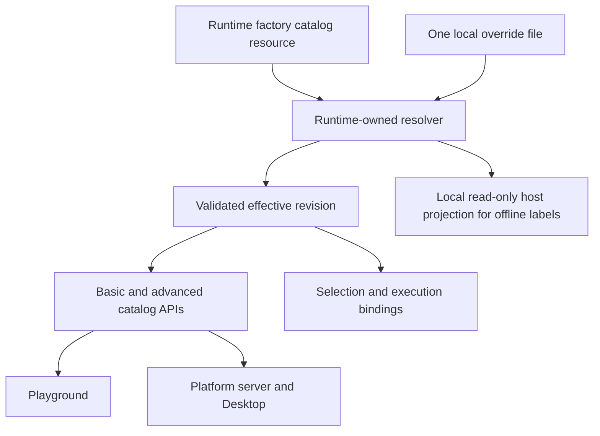

# SPEC-031: Provider Catalog Data and Local Overrides

## Metadata

| Field | Value |
|---|---|
| Status | Accepted — implementation in progress; see PLAN-040 for delivery evidence |
| Owner | Runtime catalog workstream; Platform owns its consumers and packaging |
| Reviewer | User |
| Decision | [ADR-040](../decisions/040-use-data-driven-provider-catalogs-and-local-overrides.md) |
| Plan | [PLAN-040](../plans/PLAN-040-provider-catalog-data-and-local-overrides.md) |

## Summary and Goals

A user can correct one machine's model catalog by editing one data file and
reloading it, while keeping the installed Runtime and Desktop versions unchanged.
Factory maintenance has one authored source; model data, fixed combinations, and
UI fallbacks share the same resolver. Agents learn this workflow from the canonical
maintenance skill and are prevented from restoring independent hardcoded tables.

This requires an initial software release implementing the contract. Existing
versions do not acquire these capabilities merely by receiving the proposed file.

## Scope

In scope: factory catalog data, local replacement semantics, model/control
resolution, new/resumed session behavior, Playground, Platform/Desktop label and
selector consumption, packaging, conversion tooling, and maintenance skills.

Out of scope: automatically downloading patches, a patch marketplace/editor UI,
provider installation/authentication, new provider protocols, paid verification
calls, session/workspace retention changes, and publishing a release in this task.

## FR-1: One Data Contract

The proposed schema is version 2. The exact typed representation is finalized in
PLAN-040 phase 1 against all current provider mappings before changing the loader.
The following information must be representable without model-specific code:

| Data | Required behavior |
|---|---|
| Scope | Stable provider family, backend, and transport where applicable; agent/ACP is distinct from CLI |
| Menu policy | Full curated list, shortlist, or explicitly discovery-owned/BYO-model behavior |
| Provenance | Observed CLI version/date and evidence; CLI version is informational, never an execution allowlist |
| Entry identity | Exact selectable ID separate from visible label and executable model/provider IDs |
| Options | Ordered per-model controls, exact label/token pairs, optional evidenced defaults, explicitly unsupported controls |
| Fixed combinations | Typed fixed controls, separate from editable options and provider-default metadata |
| Variants | Explicit control-value-to-execution-ID mappings for protocols such as Antigravity; no guessed string rewriting |
| Labels and metadata | Subscription suffixes, approved context/effort presentation, descriptions, limits, and evidence |

Operators may continue supplying picker text or screenshots. The maintenance
workflow produces the explicit evidenced data; it does not require users to learn
Runtime control keys or infer executable tokens from friendly names.

Keep reusable option inheritance where it is lossless. An explicit empty option
set disables inheritance. A replacement scope must contain all shared definitions
it needs; no hidden inheritance from the displaced factory scope is allowed.

An adapter binding registry defines stable supported control keys, types, and
serialization. Catalogs supply model-specific values/mappings. No raw shell
templates, scripts, arbitrary flags, endpoint/credential overrides, or filesystem
instructions are accepted as catalog data. Unknown bindings are reported rather
than discarded or simulated. Unknown model IDs using existing bindings are valid
data; a code-owned list of familiar model IDs must not gate them.

### Illustrative local Pi replacement

This is a proposed schema-2 example, not input supported by today's loader. It
deliberately demonstrates a one-row local shortlist, not a factory-list change.

```yaml
schema_version: 2
catalogs:
  - provider: pi
    backend: cli
    cli_version: "0.87.1"
    selection_mode: shortlist
    models:
      - id: openai-codex/gpt-6-astra
        label: "gpt-6-astra [openai-codex] — medium"
        execution:
          provider: openai-codex
          model: gpt-6-astra
          fixed_controls:
            pi.thinking: medium
```

There is no explicit default. The single row initializes the UI without a default
suffix. The effective mapping emits `--provider openai-codex --model gpt-6-astra
--thinking medium` through the existing Pi serializer, with no new ID branch.

## FR-2: Files and Replacement Semantics

1. Canonical factory source: `config/curated-model-catalogs.yaml.example` in
   `cats-runtime`. Generated package resources contain its validated data and
   source digest; Platform never authors another model pack.
2. Local override: `<runtimeRoot>/config/curated-model-catalogs.yaml`, normally
   `~/.cats/runtime/config/curated-model-catalogs.yaml`. Preserve the existing
   explicit provider-config sibling-path rule where configured. Resolve this
   path once and pass it to consumers; cwd must not select a different file.
3. Accept one YAML/JSON document at this path. Do not add competing `.json` and
   `.jsonl` files with implicit precedence. The absence of the file means factory.
4. Override identity is `(provider, backend, transport when relevant)`. Instance
   names, accounts, and provider groups inside a router are not interchangeable
   with that identity. A CLI override cannot affect an API/ACP scope accidentally.
5. Replace the entire matching scope, including models, options, mappings, and
   default declarations. Untouched scopes inherit the current factory pack.
   Duplicate scope keys or model IDs are invalid; ambiguous variants are invalid.
6. Omitting a model from a replacement removes it from that menu. `models: []`
   removes all curated rows in that scope. Removing the scope/file reverts to the
   current factory scope/pack. None of these operations restores a code literal.
7. A received patch may contain only changed scopes. Applying it to an existing
   local file replaces those scopes while preserving other local scopes. Helpers
   must preview the diff, check the original file digest, back up, validate the
   complete candidate, and replace atomically. Read/reload never writes this file.
8. Software upgrades replace factory resources and preserve the local file.
   Overridden scopes remain pinned as replacements; unrelated scopes receive
   factory updates. Expose factory/override origin so this behavior is visible.

## FR-3: Activation, Revision, and Failure

- Construct and validate a complete immutable candidate before activation. A
  content-derived `catalogRevision` covers effective menu and execution data.
  Record the factory digest, override digest, schema, and per-scope origin in
  diagnostics; public consumers receive the revision without personal paths.
- Startup loads the current files. Add an authenticated local-data reload operation
  (proposed `POST /providers/catalogs/reload`) with `expectedRevision`; mismatches
  return a conflict. It uses the same provider operation/lifecycle coordination
  as other configuration mutations, and never performs live model discovery.
- Successful reload returns the activated revision and affected scopes. Existing
  model/advanced responses carry it. Platform caches and label registries replace
  obsolete scope data on the next read; late responses cannot restore an earlier
  revision. Provider selection revision remains a separate authority.
- Basic and advanced results form a coherent per-target snapshot. If the basic
  request returns revision R2 while advanced metadata is retained at R1, never
  combine R2 entries with R1 controls/defaults. Retain the last coherent observed
  snapshot while revalidating, or publish R2 entry-only data with mismatched
  advanced selections withheld until reconciliation. Request-generation fences
  and Runtime activation identity reject late responses; content hashes are
  equality tokens and must not be sorted to infer which revision is newer.
- Refreshing discovery must not be required to apply a local file. Preserve the
  distinction between local reload and the existing explicit upstream refresh.
  Automatic filesystem watching is outside the first delivery.
- Invalid YAML, unsupported schema/binding, or inconsistent defaults reject the
  whole candidate, return precise diagnostics, and retain the last accepted
  revision. Do not partially apply valid scopes or silently use factory instead.
- Persist a validated last-accepted snapshot for restart continuity, scoped to
  its resolved Runtime root/config path, factory digest, schema, and adapter-binding
  compatibility. Runtime activation is its only writer. If no compatible accepted
  snapshot exists, report catalog unavailable; do not resurrect literal arrays.
  Missing/corrupt mandatory factory resources are packaging errors.
- The dedicated setup/diagnostics surface reports rejection and origin. Preserve
  Platform's existing picker spinner/recovery UX; do not inject raw transport or
  parse errors, Retry buttons, or Runtime Setup links into pickers.

## FR-4: Selection and Execution

The existing full-catalog/at-most-six-shortlist policy and custom model entry are
preserved. Managed curated scopes use the effective file-backed menu even after
discovery refresh. Discovery may annotate availability/freshness without changing
membership, labels, options, order, or explicit defaults. Other declared discovery
scopes retain runtime-owned enumeration, config/BYO behavior, and data fallback.

Preserve saved explicit selections and custom strings. Otherwise initialize to an
explicit catalog default, then the first row, then no model. First-row selection,
CLI current/active selection, and fixed combinations never create `(default)`.
Only explicit default metadata produces the normalized lowercase suffix. Preserve
all other source spelling and operator-approved display exceptions.

All new selections resolve through the same effective data: structured selections,
plain known model strings, new sessions, and explicit model switches. Resume uses
the previously recorded resolved binding under the persistence rule below.
Unknown custom IDs retain existing provider transport and acquire no guessed
effort or supported-option list. A patch does not bypass execution-target checks.

New catalog-based selection requests carry the revision they displayed. If it
changed, return a reconciliation conflict before executing changed bindings.
Record the resolved model/provider/controls and revision in each session binding;
resume and subsequent turns retain that binding until an explicit model change.
Reload must not change an existing session's fixed effort behind the user's back.
For native-discovered or pre-cutover sessions without a complete binding snapshot,
do not reconstruct historical controls from the current catalog. Preserve recorded
wire values or the provider's native resume settings. If an adapter requires an
explicit binding that cannot be recovered, require an explicit model/control
selection before resuming and record that as the first complete binding. The
tooling must distinguish this unbound state from a known binding with no controls.
Removed saved IDs remain explicit saved/custom values; they do not rejoin the
curated menu or silently switch to its first row. Historical execution records
retain the label/identity recorded at execution time.

## FR-5: Playground, Platform, and Offline Data



- Delete handwritten lists in Playground and Platform. Runtime API data drives
  live menus. Any generated factory JSON is a derivative, never an editable source.
- Export a Runtime-owned, side-effect-free catalog module for local host reads.
  It takes explicit package/runtime paths and shares validation/merge semantics;
  it must not import the server composition root, mutate config, or start probes.
  Platform consumes this module through a supported Runtime package boundary.
- The local Desktop host can reflect a newly edited valid override in offline
  informational labels without first running Runtime. It uses the matching
  packaged resolver/factory and the selected local Runtime root. The renderer
  reads host projections, not arbitrary local files. A validated file projection
  is identified as local informational data, not an activated/observed Runtime
  revision. The read-only host never writes or advances the last-accepted snapshot;
  while Runtime is reachable, live accepted data takes precedence.
- Execution pickers obey Platform SPEC-013: retain successfully observed choices
  during transient failures and recover automatically. Unobserved factory/patch
  entries never become usable targets solely because offline data lists them.
- Scope caches by Runtime connection identity, authorization context, exact target,
  selection revision, and catalog revision. Switching Runtime/account clears the
  applicable observations. Replacing a catalog removes old label-registry entries;
  process-global provider/model maps must not leak labels between connections.
- For a remote Runtime, edit that Runtime's override file. Local Desktop patches
  cannot override it. Disconnected browsers/remote consumers show their last
  observed revision until reconnection; no claim of instantaneous offline sync.
- Catalog empty/unavailable states and custom input have explicit behavior.
  Missing data returns empty/raw saved labels or an unavailable state, never an
  emergency `return '<model-id>'` branch.

## FR-6: Conversion and Packaging

Schema 1 and its human-label normalizers are the current implementation. Provide
an explicit offline conversion/preview tool that produces schema 2 using retained
evidenced mappings. It must report unresolved mappings instead of guessing, preserve
source labels/order/defaults, and require authorization before writing personal
files. A whole schema-1 snapshot converts to replacements for all scopes it contains;
do not silently delete scopes merely because they equal today's factory data.

The new execution loader accepts only the current schema. Keep any legacy parser
inside the explicit conversion tool, not parallel runtime fallback paths. Before
replacing a personal file, the apply/conversion helper checks the selected installed
Runtime's catalog capability/schema support; an unsupported or unknown installation
is left unchanged with an explicit result. A converter may still write a candidate
to a separate output path for review. Already installed schema-1 software cannot be
made to reject files differently by this design; post-load rejection guarantees
apply to the new loader only. Patch distribution states this prerequisite.

Package tests must verify npm and installed Desktop contain the exact generated
factory data, resolver, and source revision. A moved installation, read-only install
directory, custom Runtime root, and factory upgrade must all retain local-patch
behavior. Windows, macOS, and Linux path handling belong to this contract.

## FR-7: Skill Cutover

Update `skills/maintain-provider-model-catalogs/` in Runtime, not workspace mirrors.
Required changes cover `SKILL.md`, `catalog-surfaces.md`, `evidence-and-scope.md`,
paste-intake/schema tooling, and every affected provider reference.

The updated workflow must teach factory versus local scope, exact IDs/labels/tokens,
full-block replacement, reload/revision verification, rollback, and package-schema
compatibility. It must use the shared validator and stop proposing edits to static
TS/JS/HTML model tables or model-specific effort helpers. Adapter/schema work remains
a separately identified scope when a binding really is unsupported.

Retain evidence, authorization, backup, test-isolation, default-label, custom-input,
and six-row policy rules. Derivative files are generated, not hand-edited. Sync
Runtime and parent workspace `.agents` and `.claude` copies and verify equality.
Do not advertise proposed commands or schema support in an active skill before
their implementation lands. Update the skill in the same cutover delivery.

## Acceptance Scenarios

| ID | Scenario and required result |
|---|---|
| AC-01 | Fixed installed Runtime/Desktop hashes; replace Pi labels/order/fixed thinking in one file, reload, observe matching menu and captured invocation without build or version bump |
| AC-02 | Add a fixture-only previously unknown model ID through a supported binding; UI and execution accept it with zero production source changes |
| AC-03 | Patch one scope; unrelated factory/local scopes remain byte/semantically unchanged as appropriate; CLI scope does not alter API/ACP targets |
| AC-04 | Remove a row, use an empty list, remove a scope, then remove the file; replacement and factory restoration follow FR-2 exactly |
| AC-05 | Invalid or partially written candidate, unsupported binding/schema, duplicate ID/default, stale reload revision: retain accepted data and report failure without partial activation |
| AC-06 | Restart with valid data, compatible last-accepted data, and no accepted data; no silent fallback to source-code model strings |
| AC-07 | New sessions use new bindings; bound sessions retain recorded controls; discovered/unbound sessions preserve native settings or require explicit selection; stale new requests reconcile before spawn |
| AC-08 | Full-catalog options/defaults and six-plus-custom shortlists survive refresh, model switches, saved custom restore, and every plain/structured entry path |
| AC-09 | Playground/Desktop agree on labels/options/revision; base R2 plus advanced R1 never form a selection; late replies cannot restore old data; fixed combos expose no editable controls or invented defaults |
| AC-10 | Offline local host reads a new patch for informational labels; offline pickers retain only observed choices; remote/account switch never reuses local or previous-account data |
| AC-11 | Package relocation, software upgrade, and rollback preserve the intended local override; npm/Desktop resource digests agree |
| AC-12 | Convert schema 1 without loss; unresolved mappings stop conversion; preview and apply against unsupported/unknown installed capability leave the personal file unchanged |
| AC-13 | Generation/check fails when a derivative is edited or a production model table returns; intentional fixtures/evidence remain permitted |
| AC-14 | A fresh agent follows the updated canonical/mirrored skill to perform factory and local fixture changes; no manual production model literals or unsupported capability claims |

All execution assertions use isolated fake transports; no user-state sessions,
authentication, or inference quota are required. Native packaging results must be
reported per OS; documentation alone is not execution/packaging validation.

## References

- [Current curated contract](./SPEC-024-curated-cli-catalog-pack-and-evidence-overlay.md)
- [Maintenance policy and skill](./SPEC-028-provider-model-catalog-maintenance-skill.md)
- [Selected-provider boundary](./SPEC-030-provider-selection-before-bootstrap-probes.md)
- [Platform selector contract](../../../cats-platform/docs/specs/SPEC-013-provider-catalog-consumption-and-ui-seam.md)

*Last updated: 2026-09-23*
